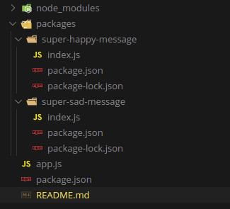

Table of Contents
- [Exemplo rápido de uso do npm link](#exemplo-rápido-de-uso-do-npm-link)
  - [Estrutura de pastas e seus arquivos](#estrutura-de-pastas-e-seus-arquivos)
  - [Processo para linkar pacotes ao ambiente de teste](#processo-para-linkar-pacotes-ao-ambiente-de-teste)
    - [No pacote](#no-pacote)
    - [No ambiente de teste](#no-ambiente-de-teste)
  - [Usar nossas libs e rodar o projeto](#usar-nossas-libs-e-rodar-o-projeto)

# Exemplo rápido de uso do npm link

## Estrutura de pastas e seus arquivos

- **app.js**: Onde está escrito o teste de uso dos nossos pacotes
- **package.json**: Configuração do nosso ambiente de teste
- **/packages**: É onde ficam nossos pacotes propostos para irem para o npm, onde vamos desenvolver nossas libs ou components.
- **/packages/super-happy-message/**: É onde ficam todos os arquivos necessários para nossa lib ou component funcionar, incluindo sua própria configuração de package.json e seus proprio node_modules caso use dependencias.

## Processo para linkar pacotes ao ambiente de teste
### No pacote
Para fazer o uso dos pacotes dentro do nosso ambiente de teste, precisamos linkar esses pacotes, o processo é como se fosse instalar um pacote do próprio npm.

Para isso vamos navegar ate a pasta raiz de algum pacote e executar o comando

`npm link`

Através desse comando o npm cria um link simbólico global para essa pasta, dessa forma conseguimos referenciar esse pacote de qualquer pasta.

### No ambiente de teste
Sendo assim, agora podemos navegar ate a raiz do nosso ambiente de teste e executar o comando

`npm link super-happy-message`

Através desse comando, fariamos o equivalente a instalar esse pacote do npm, uma pasta node_modules será criada mas dentro dela temos apenas pastas que são links simbolicos para dentro da própria pasta de packages onde estamos desenvolvendo.

> Como bonus é possivel também usar diretamente o comando `npm install /path/to/package` mas essa maneira não é a mais recomendada, isso seria mais para caso você queira testar os hooks de pre/post install do ambiente de teste

## Usar nossas libs e rodar o projeto

Feito os passos anteriores podemos importar dentro do arquivo `app.js` as libs que estamos desenvolvendo dentro da pasta de pacotes e rodar nosso app através do comando `node app.js`

> Nota importante: O npm link funciona em qualquer estrutura de pastas, não precisa seguir essa estrutura. O que temo aqui é só uma proposta para facilitar o entendimento e o desenvolvimento caso seja algo pequeno.